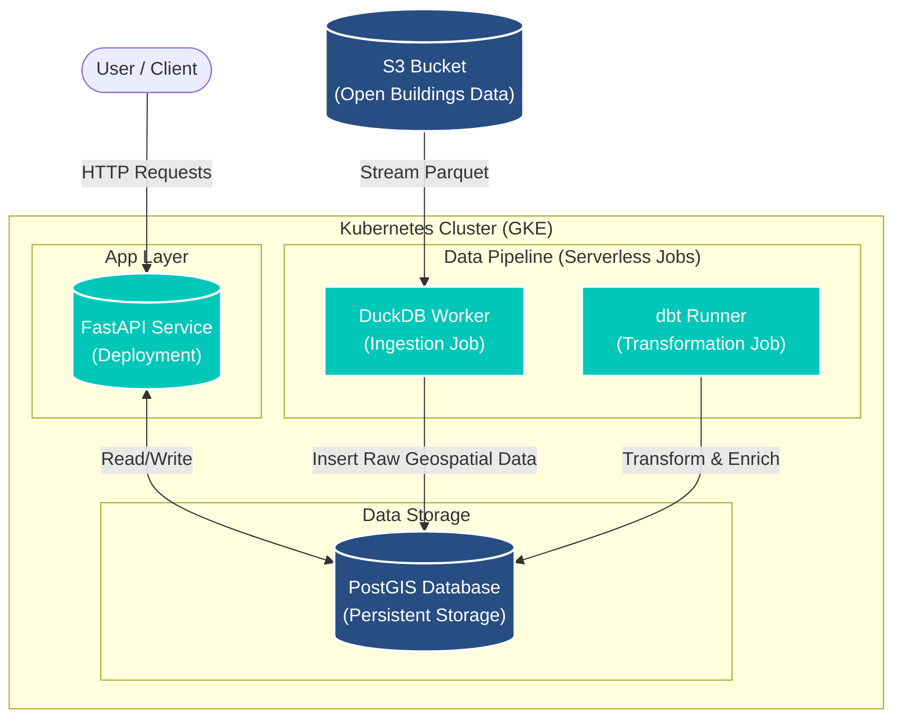

In the world of geospatial software development, building a "Hello World" map application is easy—but engineering a production-ready platform that scales is a different beast entirely.

Over the course of this blog series, we are going to take a raw concept and evolve it into a robust, cloud-native application named geoproject. We won't just be writing Python code; we will be architecting a complete ecosystem. You will see how to structure a FastAPI backend with robust dependency management, containerize complex geospatial libraries like GDAL without headaches, and orchestrate serverless ETL pipelines using DuckDB.

Finally, we will tackle the "Day 2" operations: automating database migrations, deploying to Kubernetes with Helm, and running analytical transformations with dbt. Whether you are a data engineer or a full-stack developer, this series is your blueprint for modern geospatial engineering.

### The Series Roadmap

We have broken this journey down into three distinct phases. You can read the entire series in order, or jump directly to the topic that interests you most:

[Part 1: The Foundation – Building a Production-Ready API]()
- Focus: Software Engineering & Architecture.
- What you’ll build: A structured FastAPI application with Poetry dependency management, PostGIS integration using GeoAlchemy2, and a comprehensive Pytest suite with database mocking.

[Part 2: The Infrastructure – Dockerizing GDAL and Deploying with Helm]()
- Focus: DevOps & Cloud Deployment.
- What you’ll build: A production-hardened Docker image that solves GDAL dependency hell, a self-healing Helm chart with Init Containers for migrations, and a CircleCI pipeline that runs integration tests against live databases.

[Part 3: The Pipeline – Serverless ETL with DuckDB and dbt]()
- Focus: Data Engineering & Analytics.
- What you’ll build: An on-demand ingestion engine using DuckDB to stream geospatial data from S3, and an automated transformation workflow using dbt running as Kubernetes Jobs.

This high-level diagram visualizes how the components we build in this series interact within our Kubernetes cluster.

How it works:

- Ingestion (Part 3): An ephemeral DuckDB job pulls raw Parquet data from S3, processes it in-memory, and loads it into PostGIS.
- Transformation (Part 3): A dbt job runs SQL transformations inside PostGIS to clean and enrich the spatial data (e.g., calculating bounding boxes).
- Application (Part 1): The FastAPI service queries the enriched data from PostGIS to serve user requests.
- Deployment (Part 2): All components are orchestrated by Helm on Kubernetes, ensuring scalability and reliability.

### Why This Stack Matters

By the end of this series, you won't just have code on your laptop; you will have a deployed, self-sustaining data platform. We are bridging the gap between "scripting" and "system design," combining the speed of modern Python tools with the reliability of cloud-native infrastructure.

Ready to start building? Let's begin with [Part 1]().
