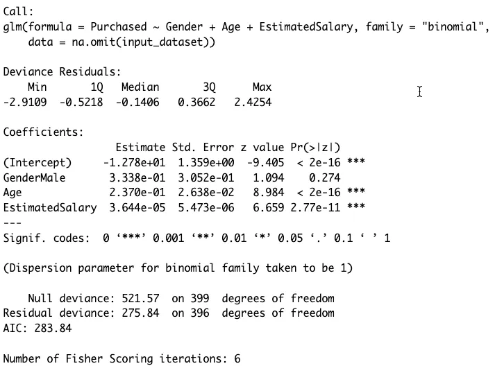

Welcome back! This post is the direct follow-up to my last article, ["The Logic Behind Logistic Regression."](/blog/blog-logistic-regression/)

In that post, we covered the theory. Now, it's time to get our hands dirty.

We're going to take a real-world dataset and walk through a complete example of implementing and interpreting a logistic regression model in R. The code itself is surprisingly short, but the insights we can pull from it are powerful.

This tutorial is broken down into three simple steps:
1.  **Getting the Data**
2.  **Building the Model**
3.  **Interpreting the Results**

Let's get started.

---

### 📊 1. Reading the Data

First, we need to load our data. I'm using a public dataset called `Social_Network_Ads.csv`.

We'll start by setting our working directory and loading the data.

```r
# Set the working directory to your file's location
setwd('Path_to_your_csv_file')

# Read the CSV file
input_dataset <- read.csv('./Social_Network_Ads.csv', na.strings="NA")

# View the first few rows of the data
head(input_dataset)
```
The **head** command shows us the first few rows of our data:

| User.ID | Gender | Age | EstimatedSalary | Purchased |
| :--- | :--- | :--- | :--- | :--- |
| 15624510 | Male | 19 | 19000 | 0 |
| 15810944 | Male | 35 | 20000 | 0 |
| 15668575 | Female | 26 | 43000 | 0 |
| 15603246 | Female | 27 | 57000 | 0 |
| 15804002 | Male | 19 | 76000 | 0 |
| 15728773 | Male | 27 | 58000 | 0 |

Our goal is to predict the Purchased column (our dichotomous 0 or 1 outcome) using Gender, Age, and EstimatedSalary as our independent variables.

A Quick Bit of Data Prep
Before we model, we have to tell R that Gender is a categorical variable (a "factor"). We'll also set "Female" as the baseline (or "reference level") to compare against.

Why do this? This changes the interpretation of the Gender coefficient from "what is the effect of 'Male'?" to "what is the effect of 'Male' compared to 'Female'?"

```r
# Convert Gender to a factor variable
input_dataset$Gender <- as.factor(input_dataset$Gender)

# Set 'Female' as the reference level
ref_level <- 'Female'
input_dataset$Gender <- relevel(input_dataset$Gender, ref_level)
```
**Quick Exploratory Data Analysis (EDA)**

It's always smart to peek at your data's structure.

```r
# See the structure of the data (variable types)
str(input_dataset)
```

```r
'data.frame':	400 obs. of  5 variables:
 $ User.ID        : int  15624510 15810944 15668575 15603246 ...
 $ Gender         : Factor w/ 2 levels "Female","Male": 2 2 1 1 2 2 ...
 $ Age            : int  19 35 26 27 19 27 ...
 $ EstimatedSalary: int  19000 20000 43000 57000 76000 58000 ...
 $ Purchased      : int  0 0 0 0 0 0 ...
```
And get a statistical summary:

```r
summary(input_dataset)
```

| Statistic | User.ID | Gender | Age | EstimatedSalary | Purchased |
| :--- | :--- | :--- | :--- | :--- | :--- |
| Min. | 15566689 | Female:204 | 18.00 | 15000 | 0:257  |
| 1st Qu. | 15626764 | Male :196 | 29.75 | 43000 | 1:143 |
| Median | 15694341 | | 37.00 | 70000 | |
| Mean | 15691539 | | 37.66 | 69742 | |
| 3rd Qu. | 15750363 | | 46.00 | 88000 | |
| Max. | 15815236 | | 60.00 | 150000 | |

**Key observations:**
- Our Gender variable is nicely balanced (204 Female, 196 Male).
- Our Purchased variable is unbalanced (143 "1s" vs 257 "0s"), but not so extreme that we need special handling for this example.

### 🚀 2. Implementing the Model
This is the best part. Building the logistic regression model in R is a single line of code.

We use the glm() function, which stands for Generalized Linear Model.

```r
logistic_classifier <- glm(formula = Purchased ~ Gender + Age + EstimatedSalary,
                           family = 'binomial',
                           data = na.omit(input_dataset))
```
**Let's quickly break that down:**
- formula = Purchased ~ Gender + Age + EstimatedSalary: This is our model. We're predicting Purchased using (~) Gender, Age, and Salary.
- family = 'binomial': This is the magic key. It tells glm() to perform a logistic regression (for a binomial outcome) instead of a standard linear regression.
- data = na.omit(...): We tell R to use our dataset and to simply ignore rows with missing data for this example.

### 📈 3. Interpreting the Results
Now, let's see what our model found. We just call summary() on the model we created.

```r
summary(logistic_classifier)
```

This gives us the main output table. The Coefficients section is what we care about most.

Coefficients:



Is My Variable Significant? (The p-value)
Look at the Pr(>|z|) column (the p-value). This tells us if a variable has a statistically significant effect.

- Age has a p-value of < 2e-16 (which is tiny) and three stars (***). This means Age is highly significant.
- GenderMale has a p-value of 0.274. This is much higher than our usual cutoff of 0.05. This means Gender is not a significant predictor in this model.

What's the Null Hypothesis? The p-value tests the "null hypothesis," which for any variable is that its coefficient $\beta$ is zero.

If $\beta$ = 0, its odds ratio ($e^\beta$) is 1. This means the variable has no effect on the odds.

A tiny p-value (like for Age) lets us "reject the null hypothesis" and conclude our variable does have a real effect.

The Magic: Interpreting Coefficients as Odds
The Estimate column is in log-odds, which are hard to understand. We need to convert them into odds ratios ($e^\beta$) to make them interpretable.

We can run this simple code to convert all our coefficients:

```r
(exp(coef(logistic_classifier)) - 1) * 100
```

This gives us the percentage change in odds for a one-unit increase in each variable.

| Variable | Percentage Change in Odds |
| :--- | :--- |
| (Intercept) | -99.999719367 |
| GenderMale | 39.632444566 |
| Age | 26.740233562 |
| EstimatedSalary | 0.003644185 |

Now we can make clear, human-readable interpretations:

- GenderMale: 39.63% Interpretation: "Being male increases the odds of purchasing by 39.63% compared to being female, holding all other variables constant." (Remember, though, this variable was not statistically significant!)

- Age: 26.74% Interpretation: "For each additional year of age, the odds of purchasing increase by 26.74%."

- EstimatedSalary: 0.003644185 Interpretation: This number is tiny because its unit is a single dollar. It's easier to scale it. For every $10,000 increase in salary, the odds of purchasing would increase by a much more significant amount.

How Good is the Model Overall?
Finally, look at the bottom of the summary() output.

- Null Deviance (509.9): This is the "badness of fit" for a model with no variables (an "empty" model).
- Residual Deviance (264.1): This is the "badness of fit" for our model.
- The fact that our Residual Deviance is much lower (a drop of ~245) than the Null Deviance shows that our set of variables (Age, Gender, Salary) is much better at predicting the outcome than just guessing.
- AIC (Akaike Information Criterion): This is another fit measure. It's mainly useful for comparing models. If you built another model with different variables, you would prefer the one with the lower AIC.

✅ Conclusion
And that's it! From just a few lines of R, we were able to:

- Load and prepare data.
- Build a logistic regression model.
- Determine which variables were significant predictors (Age).
- Translate cryptic log-odds into clear, interpretable percentages ("a 26.7% increase in odds per year").
- Confirm that our model, as a whole, is a good fit for the data.
- Hopefully, by combining the theory from the last post with this practical example, you now have a solid grasp of how (and why) to use logistic regression.

Please leave a comment if you have any questions!

### References

Most of the content was reviewed in detail from:

1. Pampel, F. C. (2000). Quantitative Applications in the Social Sciences: Logistic regression Thousand Oaks, CA: SAGE Publications Ltd doi: 10.4135/9781412984805. URL: http://methods.sagepub.com/book/logistic-regression/n1.xml